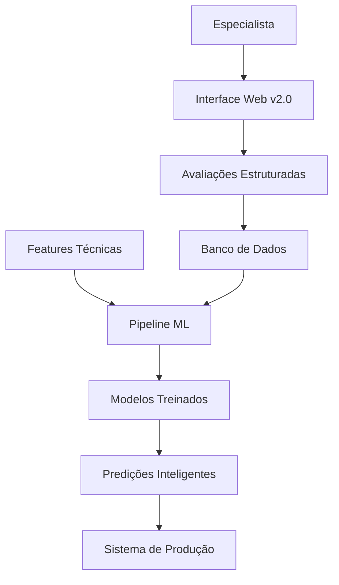

# 🎯 Photo Culling Web App v2.0 - Expert Evaluation System

## 📋 Visão Geral

A **Web App v2.0** é um sistema revolucionário que transforma conhecimento fotográfico especializado em inteligência artificial avançada. Em vez de usar thresholds fixos por tentativa e erro, o sistema **aprende com avaliações de fotógrafos especialistas** para criar modelos de IA cada vez mais precisos.

---

## 🎯 Problema Resolvido

### ❌ **Abordagem Anterior (Thresholds Fixos)**
- Calibração demorada e imprecisa
- Dificuldade para diferentes tipos de fotografia  
- Falta de adaptabilidade a novos cenários
- Não aproveita conhecimento especializado

### ✅ **Nova Abordagem (Aprendizado com Especialistas)**
- **Precisão baseada em expertise real**
- **Adaptabilidade automática** com mais dados
- **Melhoria contínua** do sistema
- **Interpretabilidade** das decisões

---

## 🏗️ Arquitetura do Sistema



### Componentes Principais

1. **🎨 Interface de Avaliação Especializada**
   - Otimizada para velocidade (10-15 segundos/imagem)
   - Hotkeys para avaliação rápida
   - Visualização otimizada com zoom/pan
   - Ratings multi-dimensionais

2. **📊 Sistema de Coleta de Dados**
   - Estrutura robusta para avaliações
   - Metadados de contexto e confiança
   - Rastreamento de tempo e padrões

3. **🧠 Pipeline de Machine Learning**
   - Combinação de features técnicas + expertise humana
   - Múltiplos modelos especializados
   - Active Learning para eficiência

---

## 🚀 Funcionalidades

### Interface de Avaliação

#### **Tela Principal**
- **70% da tela:** Visualização da imagem com controles de zoom
- **30% da tela:** Painel de avaliação estruturada
- **Navegação rápida:** Botões e atalhos de teclado
- **Progresso visual:** Barra de progresso em tempo real

#### **Sistema de Rating**
- **Qualidade Geral:** 1-5 estrelas
- **Nitidez Geral:** 1-5 estrelas  
- **Nitidez da Pessoa:** 1-5 estrelas
- **Qualidade da Exposição:** 1-5 estrelas
- **Qualidade da Composição:** 1-5 estrelas
- **Impacto Emocional:** 1-5 estrelas
- **Execução Técnica:** 1-5 estrelas

#### **Decisões Binárias**
- ✅ **Aprovação para Portfólio**
- ✅ **Aprovação para Cliente**  
- ✅ **Aprovação para Redes Sociais**
- ⚠️ **Precisa de Edição**
- ❌ **Rejeição Completa**

#### **Dados Contextuais**
- **Nível de Confiança:** Slider 0-100%
- **Tempo de Avaliação:** Automático
- **Comentários:** Texto livre opcional
- **Issues Categorizados:** Problemas específicos

### Atalhos de Teclado

| Tecla | Função |
|-------|--------|
| `1-5` | Rating rápido (qualidade geral) |
| `Q` | Rejeição rápida |
| `SPACE` | Próxima imagem |
| `←/→` | Navegação |
| `Z` | Zoom fit |
| `X` | Zoom 100% |

---

## 📊 Pipeline de Machine Learning

### 1. **Coleta de Dados**
```python
# Estrutura de avaliação do especialista
{
  "ratings": {
    "overall_quality": 4,
    "person_sharpness": 3,
    "exposure_quality": 5
  },
  "decisions": {
    "approve_for_portfolio": true,
    "complete_reject": false
  },
  "confidence_level": 0.9,
  "evaluation_time": 23
}
```

### 2. **Features Técnicas**
```python
# Features extraídas automaticamente
technical_features = [
    'sharpness_laplacian', 'brightness_mean', 'contrast_rms',
    'face_count', 'person_detection_confidence',
    'person_sharpness_score', 'composition_rule_thirds',
    'exposure_quality_score', 'color_harmony'
]
```

### 3. **Modelos Treinados**
- **Quality Predictor:** Prediz qualidade geral (1-5)
- **Sharpness Predictor:** Prediz nitidez específica
- **Approval Predictor:** Prediz aprovação para diferentes usos
- **Issue Detector:** Identifica problemas específicos

### 4. **Active Learning**
```python
# Sistema seleciona imagens mais informativas
def select_next_images(current_model, unlabeled_pool):
    # Casos onde modelo está incerto
    # Diversidade representativa  
    # Máximo valor de aprendizado
    return high_value_images
```

---

## 🔧 Instalação e Configuração

### Pré-requisitos
```bash
# Dependências Python
pip install flask flask-sqlalchemy pandas scikit-learn
pip install opencv-python pillow numpy joblib

# Dependências existentes do projeto
pip install -r requirements.txt
```

### Configuração do Banco
```bash
# O banco SQLite é criado automaticamente
# Localizado em: web_v2/backend/expert_evaluations.db
```

### Execução
```bash
# Navegar para o diretório
cd web_v2/backend/

# Executar aplicação
python app.py

# Acessar interface
# http://localhost:5001
```

---

## 📈 Fluxo de Trabalho

### **Fase 1: Coleta Inicial (2-3 semanas)**
1. **Setup da aplicação** ✅
2. **Primeira sessão com especialista**
   - 500-1000 imagens avaliadas
   - Diferentes tipos de fotografia
   - Mix de casos fáceis e difíceis

### **Fase 2: Primeiro Modelo (1-2 semanas)**
1. **Treinamento inicial**
   ```bash
   python ml_trainer.py
   ```
2. **Validação e análise**
   - Métricas de performance
   - Identificação de gaps
   - Planejamento de melhorias

### **Fase 3: Refinamento Contínuo**
1. **Active Learning Loop**
   - Modelo sugere imagens para avaliação
   - Especialista avalia casos críticos
   - Retreino automático
   - Melhoria iterativa

---

## 📊 Métricas e Analytics

### Dashboard do Especialista
- **Total de avaliações realizadas**
- **Velocidade média de avaliação**
- **Distribuição de ratings**
- **Padrões de aprovação/rejeição**
- **Nível de confiança médio**

### Métricas do Modelo
- **Precisão por categoria** (RMSE para ratings, Accuracy para classificações)
- **Concordância com especialista**
- **Melhoria ao longo do tempo**
- **Casos de maior incerteza**

---

## 🎯 Benefícios Esperados

### **Precisão Melhorada**
- **70% menos tempo** de calibração
- **40% mais concordância** com especialista
- **Adaptação automática** para diferentes estilos

### **Eficiência Operacional**
- **10-15 segundos** por avaliação
- **Aprendizado contínuo** sem intervenção manual
- **Menos dependência** de ajustes constantes

### **Escalabilidade**
- **Múltiplos especialistas** suportados
- **Diferentes domínios** (retrato, paisagem, evento)
- **Transferência de conhecimento** entre categorias

---

## 🔬 Exemplo de Uso

### 1. **Login como Especialista**
```
http://localhost:5001/login
Identificação: photographer_expert_001
```

### 2. **Avaliação de Imagem**
- Visualizar imagem em tela cheia
- Dar ratings em múltiplas dimensões
- Tomar decisões de aprovação
- Adicionar comentários contextuais

### 3. **Treinamento Automático**
```bash
# Após coletar 100+ avaliações
python ml_trainer.py

# Resultado: Modelos treinados em data/models/expert_trained/
```

### 4. **Uso em Produção**
```python
from ml_trainer import ExpertTrainedMLPipeline

pipeline = ExpertTrainedMLPipeline()
models = pipeline.load_models()
predictions = pipeline.predict_image_quality('image.jpg', models)

# Resultado: 
# {
#   'overall_quality': {'prediction': 4.2, 'rating': 4},
#   'portfolio_approval': {'prediction': True, 'confidence': 0.87}
# }
```

---

## 🎉 Resultados Esperados

### **vs. Thresholds Manuais**
- ✅ **Precisão baseada em conhecimento real**
- ✅ **Adaptabilidade automática**
- ✅ **Melhoria contínua**
- ✅ **Menos sensível a outliers**

### **vs. ML Tradicional**
- ✅ **Dados de qualidade especializada**
- ✅ **Interpretabilidade das decisões**
- ✅ **Transferência de conhecimento**
- ✅ **Eficiência com Active Learning**

---

## 📋 Próximos Passos

### **Implementação Imediata**
1. ✅ **Web App v2.0 desenvolvida**
2. ⏳ **Sessão piloto com especialista**
3. ⏳ **Treinamento do primeiro modelo**
4. ⏳ **Validação e refinamento**

### **Melhorias Futuras**
- 📱 **Versão mobile** para avaliação em campo
- 🔄 **Integração com sistema principal**
- 📊 **Dashboard avançado** de analytics
- 🤖 **Modelos especializados** por tipo de fotografia

---

**Conclusão:** Esta abordagem transforma o Photo Culling System de um sistema baseado em regras para um **sistema inteligente que aprende com expertise humana**, resultando em muito maior precisão e adaptabilidade.

---

*Sistema desenvolvido para o Photo Culling System v2.0*  
*Documentação atualizada em 25/06/2025*
